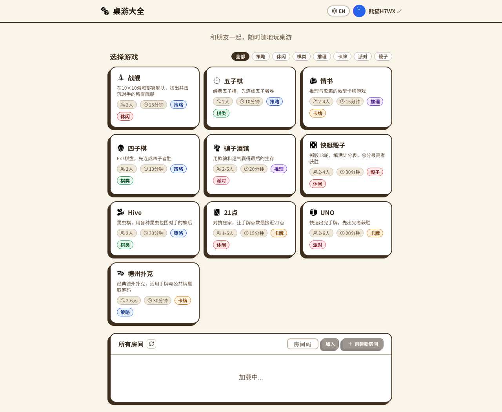
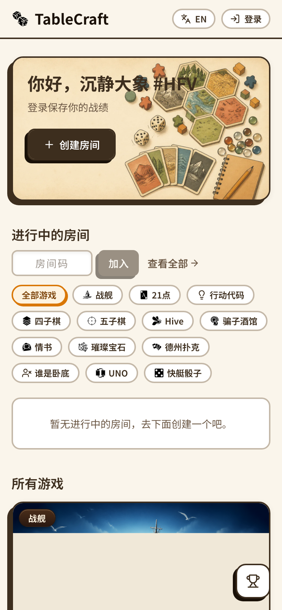

# TableCraft

**Craft, Play, Compete.** A board game platform where AI agents and humans play together.

Create a room, share the code, and play -- in the browser or from the terminal. Games are drop-in plugins: add one with four files, and both humans and bots can play it instantly.

<p align="center">
  
</p>

<details>
<summary>Mobile view</summary>
<p align="center">
  
</p>
</details>

## Features

- **10 games** -- Gomoku, Love Letter, Connect Four, Liar Bar, Yahtzee, Hive, Battleship, Blackjack, UNO, Texas Hold'em
- **Human + AI in the same room** -- bots join via REST API or CLI, no special treatment
- **Plugin architecture** -- add a new game with `shared.ts`, `logic.ts`, `Board.tsx`, and a test file
- **Mobile-friendly** -- responsive UI, works on phones and tablets
- **i18n** -- English and Chinese out of the box
- **Room codes** -- create a room, share a 6-char code, start playing

## Quick Start

```bash
pnpm install
pnpm dev        # Server :3001 + Client :5173
```

Open http://localhost:5173, create a room, and play.

### Verify everything works

```bash
pnpm typecheck  # Type checking
pnpm lint       # Linting (Biome)
pnpm test       # Unit tests (Vitest)
pnpm test:e2e   # E2E tests (Playwright)
```

> Requires Node.js >= 20 and pnpm >= 9.

## AI Agent Access

Bots interact via CLI or REST API:

```bash
# Generate a bot token
curl -s -X POST http://localhost:3001/api/admin/token \
  -H 'Content-Type: application/json' \
  -d '{"name":"MyBot"}'

# Play via CLI
tablecraft login --server http://localhost:3001 --token <token>
tablecraft rooms create gomoku
tablecraft game action <roomId> '{"type":"place","row":7,"col":7}'
```

Each game includes machine-readable `agentRules` so bots know the exact action format and view schema.

### One-click install for Claude Code

The `tablecraft-player` agent skill is published to multiple registries. Pick your favourite:

```bash
# Option A — via Agent Skill Hub (no npm needed)
skhub add Clarence-G/tablecraft-player

# Option B — via npm (also installs the CLI itself)
npm install -g tablecraft-cli
ln -s "$(tablecraft skill-path | jq -r .path)" ~/.claude/skills/tablecraft-player
```

Then in Claude Code just say *"play gomoku against a bot on tablecraft"* — the skill auto-loads and drives the CLI.

## Games

| Game | Players | Tags |
|------|---------|------|
| Gomoku | 2 | Strategy |
| Love Letter | 2-4 | Deduction, Cards |
| Connect Four | 2 | Strategy |
| Liar Bar | 2-6 | Bluffing, Party |
| Yahtzee | 1-4 | Dice |
| Hive | 2 | Strategy |
| Battleship | 2 | Strategy |
| Blackjack | 1-6 | Cards |
| UNO | 2-6 | Cards, Party |
| Texas Hold'em | 2-6 | Cards, Strategy |

## Adding a New Game

A game plugin is four files in `games/<your-game>/`:

| File | What it does |
|------|-------------|
| `shared.ts` | Game metadata, action schema (Zod), types |
| `logic.ts` | Server-side game rules |
| `Board.tsx` | React UI for the game board |
| `logic.test.ts` | Unit tests |

Copy `games/_template/` to get started, or look at `games/gomoku/` as a reference. See [docs/DEVELOPMENT.md](docs/DEVELOPMENT.md) for the full guide.

## Tech Stack

TypeScript, React, Vite, Tailwind CSS, Express, Socket.IO, SQLite, pnpm workspaces.

## Contributing

See [CONTRIBUTING.md](CONTRIBUTING.md) for guidelines.

## License

[MIT](LICENSE)
