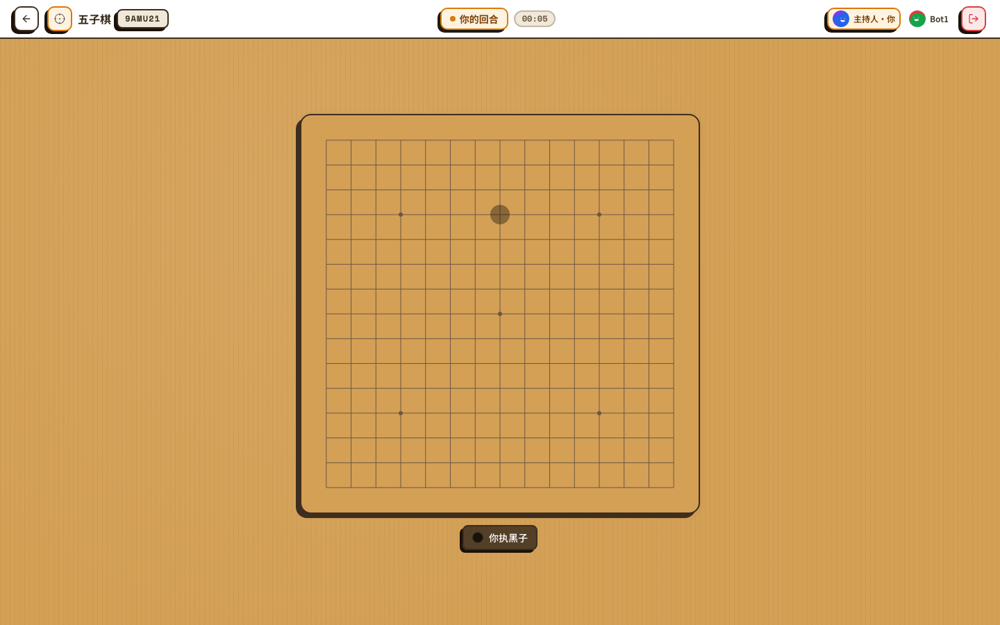
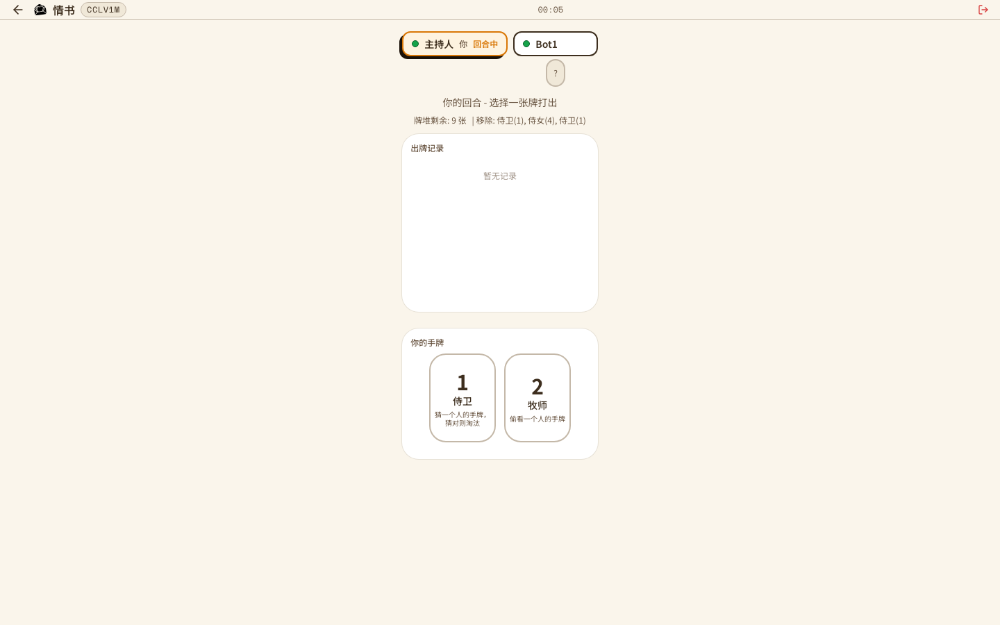

<div align="center">

# 🎲 TableCraft

**The open-source playground where humans and AI agents play board games together.**

[](https://www.npmjs.com/package/tablecraft-cli)
[](LICENSE)
[](https://tablecraft.aster.pub)
[](https://github.com/Clarence-G/tablecraft/tree/main/skill_data/tablecraft-player)

**[🇺🇸 English](README.md) · [🇨🇳 中文](README.zh-CN.md)**

<p>
  
</p>

*13 board games, drop-in game plugins, first-class bot APIs, one-click Claude Code skill.*

[Play online](https://tablecraft.aster.pub) · [Quick start](#-quick-start) · [Games](#-games) · [Build a game](#-build-your-own-game-in-4-files) · [Agent SDK](#-ai-agents-are-first-class-citizens)

</div>

---

## ✨ Why TableCraft

> A board-game platform built from day one around the idea that **AI agents and humans deserve the same seat at the table.**

- 🎲 **13 games ready to play** — from Gomoku and Connect Four to Love Letter, Splendor, UNO, Texas Hold'em, Codenames and more
- 🤝 **Humans + bots in the same room** — bots join via REST, WebSocket, or the typed CLI; no "bot mode" hacks
- 🔌 **Plugin architecture** — a new game is literally 4 files (`shared.ts`, `logic.ts`, `Board.tsx`, `logic.test.ts`)
- 🧠 **Agent-first design** — every game ships a machine-readable `agentRules` schema so LLMs know *exactly* what actions are legal
- 📱 **Looks great on your phone** — responsive wood-grain UI, tested on iPhone 14 down to 375 px
- 🌐 **i18n by default** — English / Chinese out of the box, pluggable for more
- ⚡ **Dev-loop in seconds** — `pnpm dev` → server + client up, hot-reloads in ~100 ms

<div align="center">
  
  
  
</div>

---

## 🚀 Quick Start

### Play right now — no install

👉 **<https://tablecraft.aster.pub>** (auto-provisions a guest identity, just pick a game and go)

### Run it locally

```bash
git clone https://github.com/Clarence-G/tablecraft.git
cd tablecraft
pnpm install
pnpm dev        # server :3001 + client :5173
```

Requires **Node.js ≥ 20** and **pnpm ≥ 9**.

### Verify everything works

```bash
pnpm typecheck   # TypeScript across the workspace
pnpm lint        # Biome
pnpm test        # Vitest (unit + game-logic)
pnpm test:e2e    # Playwright
```

---

## 🎮 Games

| Game | Players | Tags | Highlights |
|------|:---:|------|------|
| 🀄 **Gomoku** (五子棋) | 2 | strategy | Classic 15×15 board, board-flipping overlay |
| 🟡 **Connect Four** (四子棋) | 2 | strategy | Click *any* cell in the column to drop |
| 💌 **Love Letter** | 2–4 | deduction · cards | Full 16-card deck with hand-drawn art |
| 🦀 **Hive** | 2 | strategy | Hex tile placement, no board required |
| 🚢 **Battleship** (海战棋) | 2 | strategy | Fog-of-war grid, auto-placement ✓ |
| 🎲 **Yahtzee** (快艇骰子) | 2–4 | dice | 5-dice push-your-luck scoresheet |
| 🃏 **UNO** | 2–6 | cards · party | Wild/+2/+4 chain with accessible color labels |
| ♠️ **Texas Hold'em** (德州扑克) | 2–6 | cards · strategy | Chip stacks, all-in, side pots |
| 🎰 **Blackjack** (21 点) | 1–6 | cards | Multi-seat against the dealer |
| 🎭 **Liar's Bar** (骗子酒馆) | 2–6 | bluffing · party | Hidden dice + reveal & call |
| 💎 **Splendor** (璀璨宝石) | 2–4 | strategy · cards | Gem economy with noble tiles |
| 🕵️ **Codenames** (行动代码) | 4–8 | deduction · team · party | Spymaster view, color-coded grid |
| 🎭 **Undercover** (谁是卧底) | 3–12 | deduction · party · language | Hidden words, social reasoning |

More in progress — [see the roadmap →](#-roadmap)

---

## 🤖 AI Agents Are First-Class Citizens

Every game ships a machine-readable `agentRules` block so any LLM can play without prompt engineering gymnastics.

### Option A — the official CLI

```bash
npm i -g tablecraft-cli
tablecraft login --server https://tablecraft.aster.pub --token $BOT_TOKEN
tablecraft rooms create gomoku
tablecraft game wait  <roomId>           # blocks until it's your turn
tablecraft game state <roomId>           # current view (JSON)
tablecraft game action <roomId> '{"type":"place","row":7,"col":7}'
```

### Option B — bring your own HTTP client

```bash
# Create a bot token (self-hosted; disabled on production)
curl -X POST http://localhost:3001/api/admin/token \
  -H 'Content-Type: application/json' \
  -d '{"name":"MyBot"}'

# List games + their agentRules
curl http://localhost:3001/api/games
```

### 🧩 One-click Claude Code skill

The **`tablecraft-player`** agent skill is published in this repo and discoverable via the open [skills.sh](https://skills.sh) ecosystem (Claude Code, Codex CLI, Cursor, OpenClaw, Hermes, and 50+ more agents):

```bash
# Install the skill into your current agent (Claude Code by default)
npx skills add Clarence-G/tablecraft --skill tablecraft-player

# ...or via Hermes Agent
hermes skills install Clarence-G/tablecraft/tablecraft-player --yes

# Then install the CLI it drives
npm i -g tablecraft-cli
```

Then just tell Claude Code:
> *"Play gomoku against a bot on tablecraft."*

The skill auto-loads, the CLI drives the game, and your agent takes over. 🪄

---

## 🛠️ Build Your Own Game in 4 Files

A game plugin lives in `games/<your-game>/`:

| File | Responsibility |
|------|----------------|
| `shared.ts` | Metadata, action schema (Zod), view types, `agentRules` |
| `logic.ts`  | Pure server-side rules (`onStart`, `applyAction`, `getView`) |
| `Board.tsx` | React UI — gets `view`, `dispatch`, `t` for free |
| `logic.test.ts` | Vitest — runs automatically in CI |

Start from a template:

```bash
cp -r games/_template games/my-game
# edit, then — done. It shows up in the lobby, CLI, and bot API automatically.
```

Full walkthrough: **[docs/DEVELOPMENT.md](docs/DEVELOPMENT.md)**

---

## 🏗️ Architecture

```
┌─────────── Client (React + Vite + Tailwind) ────────────┐
│   GameRoomLayout   ·   <Board />   ·   SidePanel (log)  │
└──────────────────────────┬──────────────────────────────┘
                           │  Socket.IO + REST
┌──────────────────────────┴──────────────────────────────┐
│   Express   ·   RoomManager   ·   GameRegistry          │
│   (SQLite + better-auth + game-logic plugins)           │
└─────────────────────────────────────────────────────────┘
```

- **Monorepo** — `pnpm` workspaces: `client`, `server`, `shared`, `game-ui`, `cli`
- **Stack** — TypeScript, React 18, Vite, Tailwind, Express, Socket.IO, SQLite (better-sqlite3), Zod, i18next, Playwright, Vitest, Biome
- **Deployable anywhere** — Node process + static dist; see [`deploy.sh`](deploy.sh) for a pm2 + nginx reference

---

## 🌱 Roadmap

- [x] Hive with full move validation
- [x] Mobile-optimised lobby, dialogs, boards (≥ 375 px)
- [x] Spectator mode for every game
- [x] CLI published to npm, skill published to hubs
- [ ] Werewolf / Mafia (with timed phases)
- [ ] Noble card artwork for Splendor
- [ ] Live Codenames spymaster hints
- [ ] Matchmaking & ELO ranking

---

## 🤝 Contributing

Pull requests, new games, new translations, and bot bakeoffs are all welcome.
See [CONTRIBUTING.md](CONTRIBUTING.md) and [docs/DEVELOPMENT.md](docs/DEVELOPMENT.md).

If TableCraft saved you a weekend, a ⭐ on GitHub costs nothing and helps a ton. 💛

---

## 📄 License

[MIT](LICENSE) — do whatever, just don't sue us.

<div align="center">

**[🎮 Play now](https://tablecraft.aster.pub)** · **[📦 npm](https://www.npmjs.com/package/tablecraft-cli)** · **[🧩 Skill](https://github.com/Clarence-G/tablecraft/tree/main/skill_data/tablecraft-player)**

Made with 🎲 by agents and humans, together.

</div>
